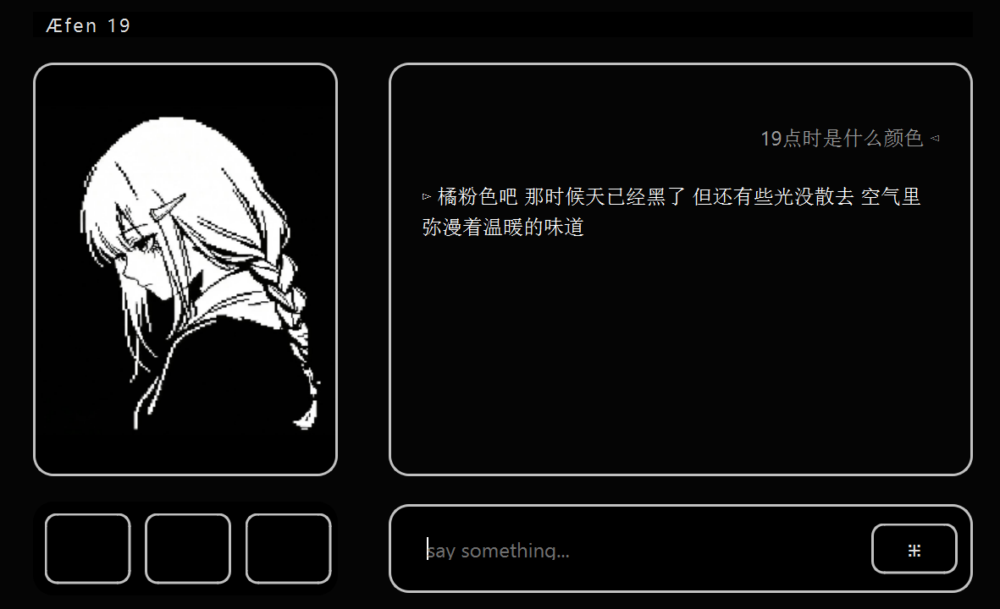

  

# Aefen19

Aefen (Old English: Ǣfen) means *evening*.  
Aefen19 refers to the quiet hour around 19:00, when the day slows down and conversations begin.

This project explores LoRA fine-tuning for building calm, natural dialogue models.

  

